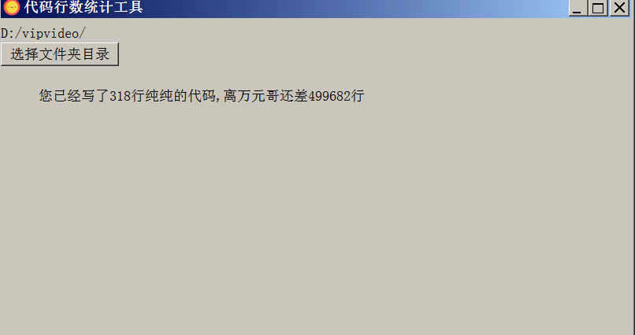
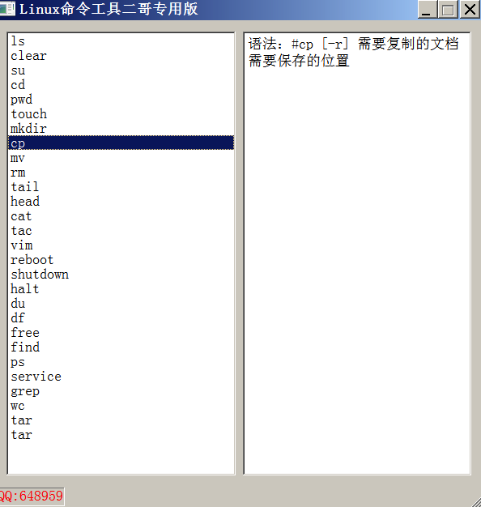
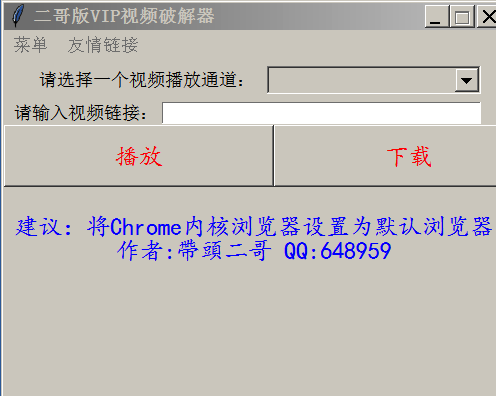

# github地址
```
https://github.com/nacker/17demo
```

## 1.代码行数统计工具
### 1.1软件说明
```
统计自己每天代码行数
开发语言 c++
开发软件 QT
```
### 1.2界面



## 2.Linux命令工具
### 2.1软件说明
```
Linux命令提示工具
开发语言 c++
开发软件 QT
```
### 2.2界面


## 3.VIP视频破解软件
### 3.1软件说明
```
免费观看各大视频网站VIP,生活需要色彩,学习娱乐两不误.
开发语言 Python3.7
开发软件 PyCharm
```
### 3.2界面


说明

```
有兴趣继续往上叠加功能的联系我.
只有一个软件打包了,我没有windows电脑,请大家自行打包,
或者打包了给我我在上传打过包的软件.
```
